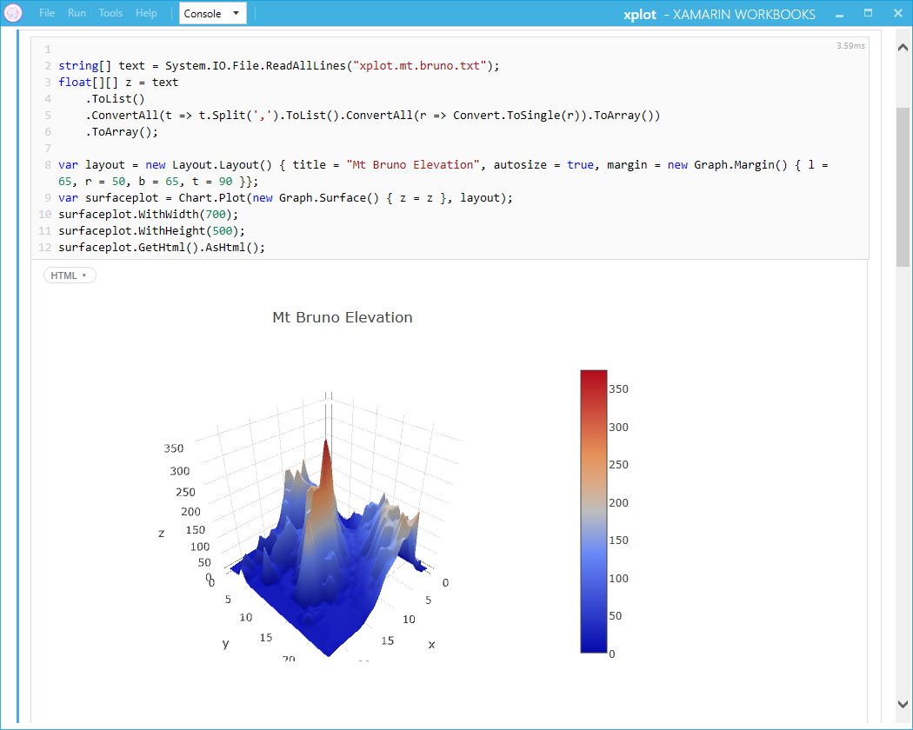
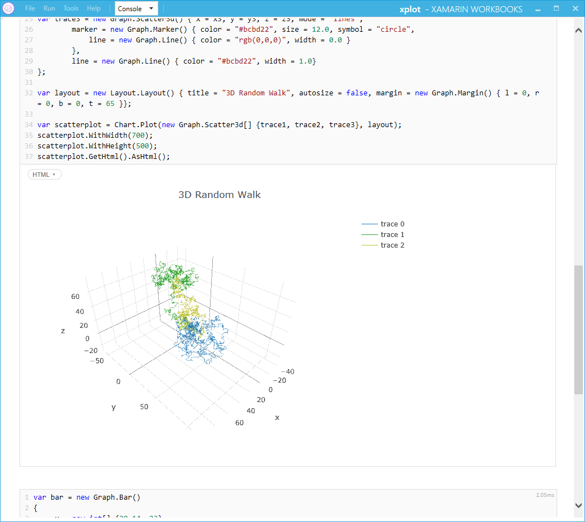
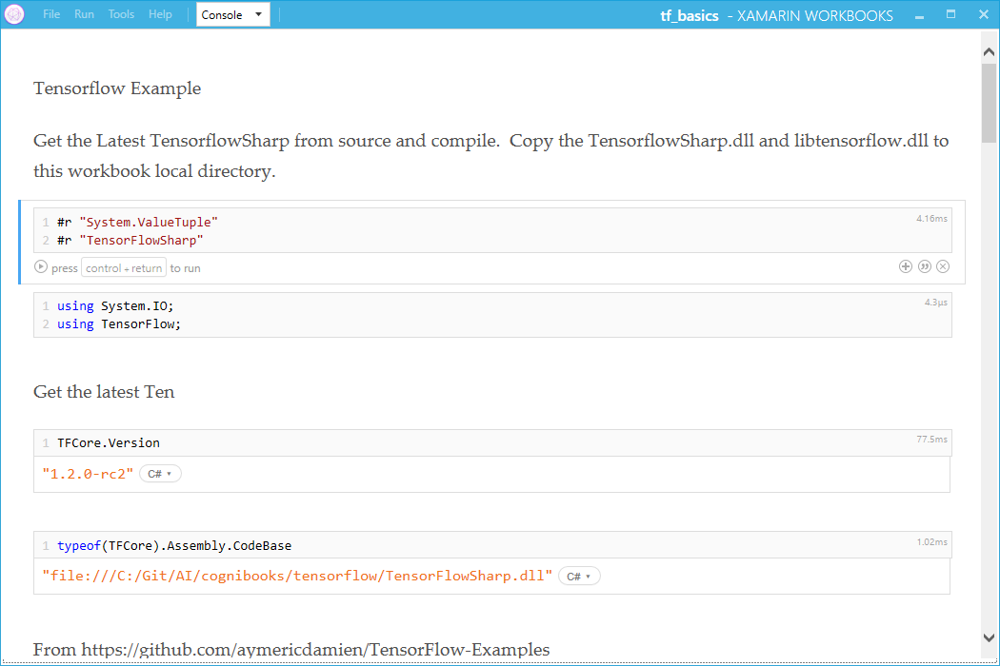
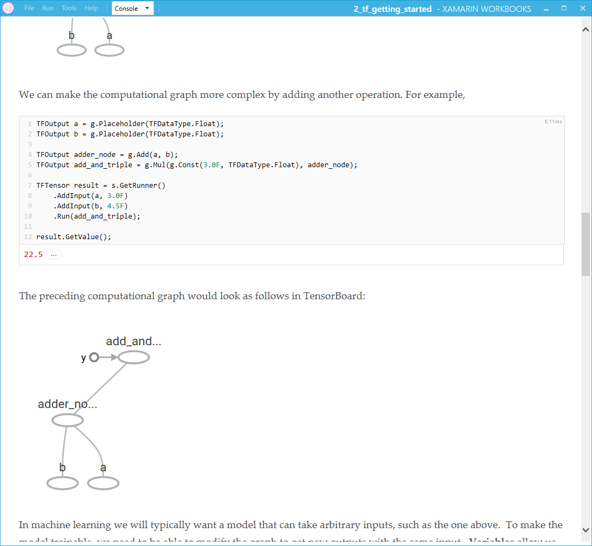
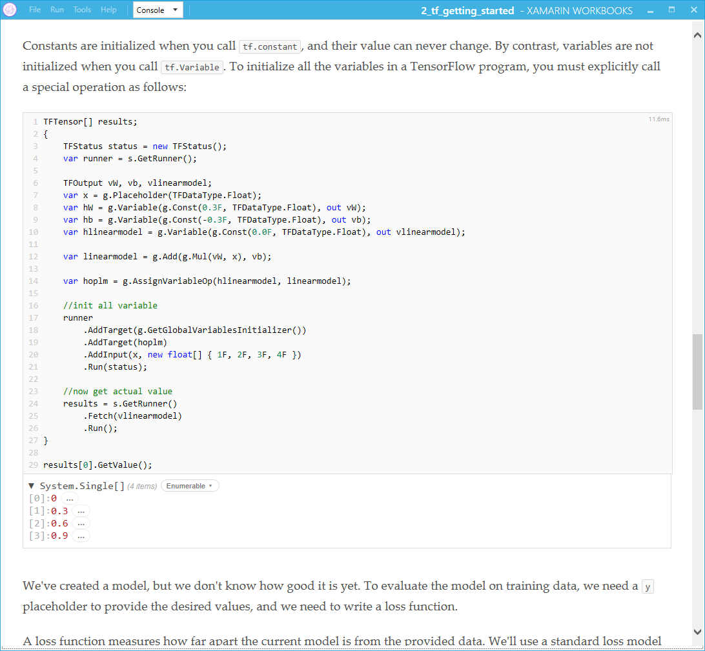
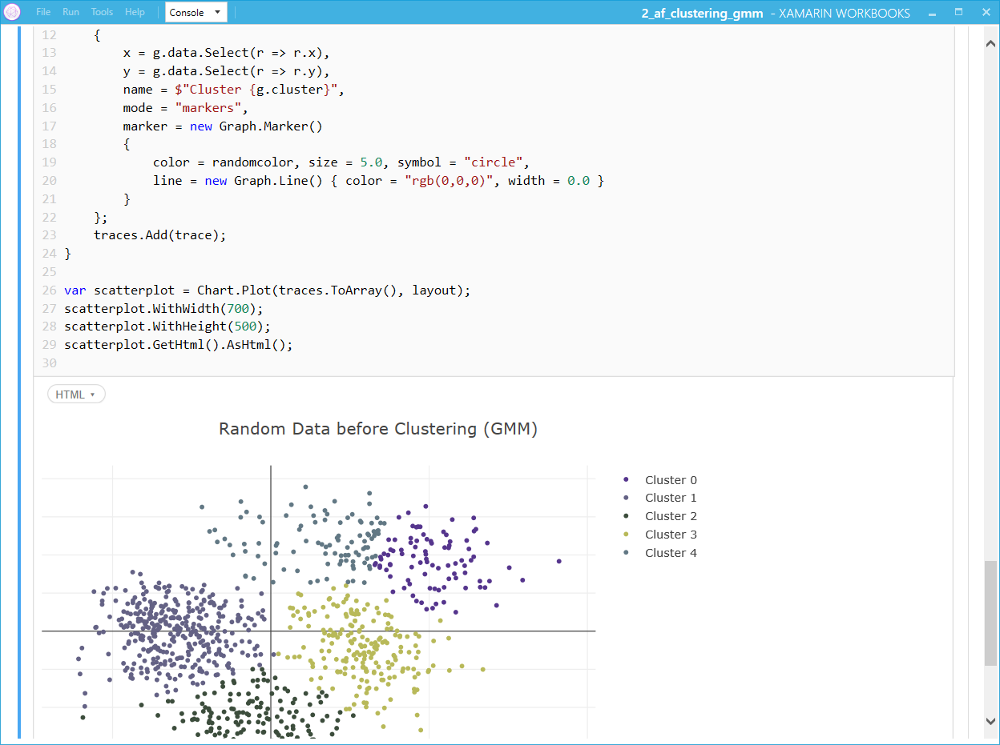

# Introduction
This is the LarcAI playground for Cognitive Sciences (AI, ML) in the .Net C# world
It is basically the kaggle of the C# world

## Xamarin Workbooks
The workbooks are build in 
[Xamarin Workbooks](https://developer.xamarin.com/guides/cross-platform/workbooks/)

## Nuget
- Each wokbook may require packages available on Nuget www.nuget.org
- The workbooks will have comment and refeneces to guide on the packages needed

### XPlot Wokbooks
This workbook show of the Xplot

### Tensorflow

### CNTK

Unfortunately CNTK does not have proper C# bindings yet

### Accord Framework

Example showing the GMM clustering

Example showing t-SNE on MNIST dataset

