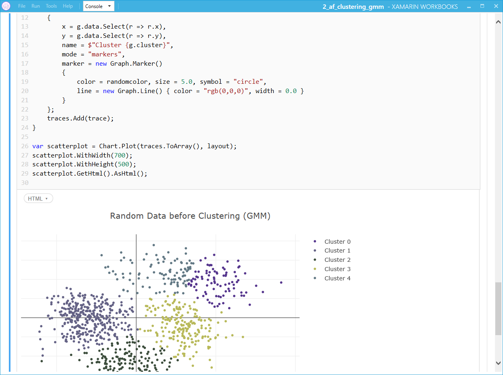
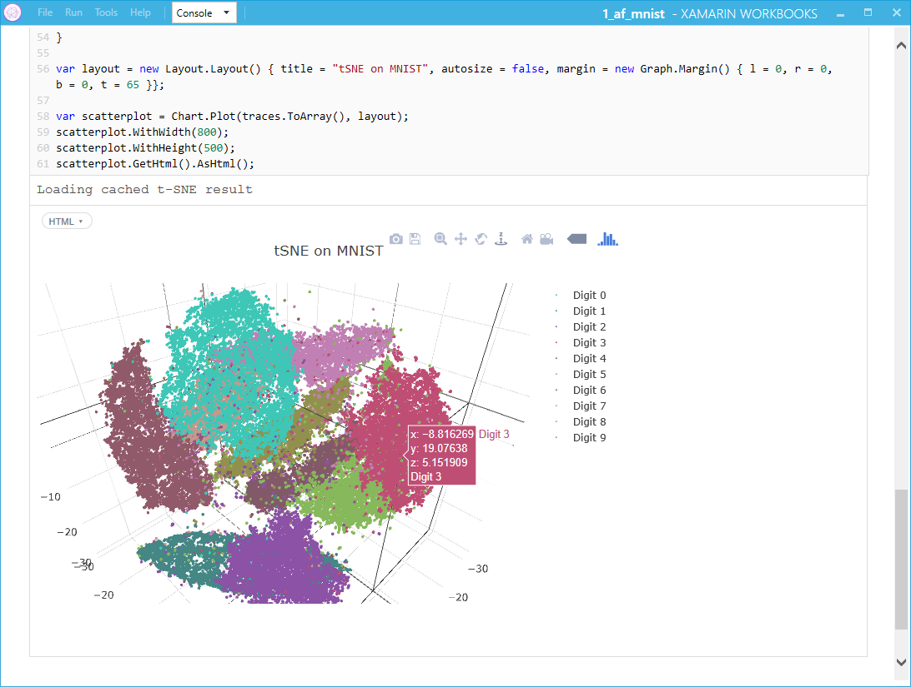

# Introduction

This is a list of Xamarin Workbooks for getting started with Accord Framework for .Net

## Xamarin Workbooks
Download 
[Xamarin Workbooks](https://developer.xamarin.com/guides/cross-platform/workbooks/)

## Nuget
- Each wokbook may require packages available on Nuget www.nuget.org
- The workbooks will have comment and refeneces to guide on the packages needed

### Accord Framework

Click here for more information on the [Accord Framework](http://accord-framework.net/) and on [Accord Github](https://github.com/accord-net/framework)

Example showing the GMM clustering

Example showing t-SNE on MNIST dataset

