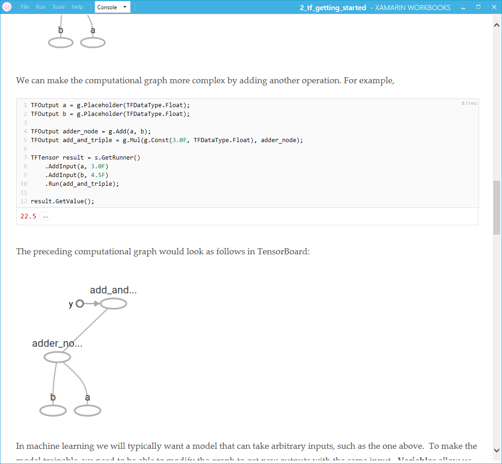
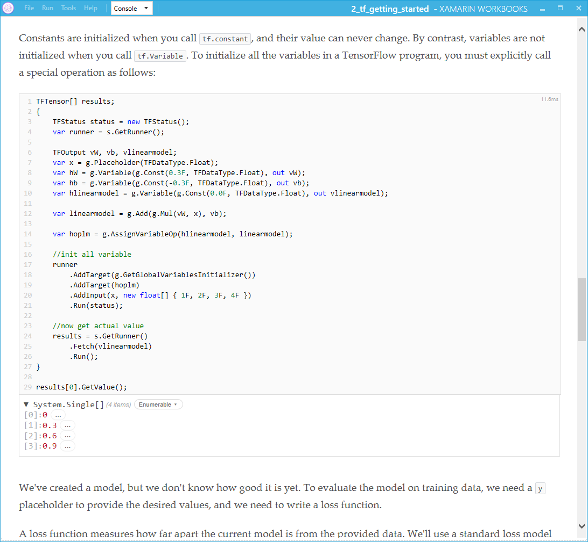

# Introduction

This is a list of Xamarin Workbooks for getting started with TF#

## Xamarin Workbooks
Download 
[Xamarin Workbooks](https://developer.xamarin.com/guides/cross-platform/workbooks/)

## Nuget
- Each wokbook may require packages available on Nuget www.nuget.org
- The workbooks will have comment and refeneces to guide on the packages needed

### Tensorflow

Some screenshots

